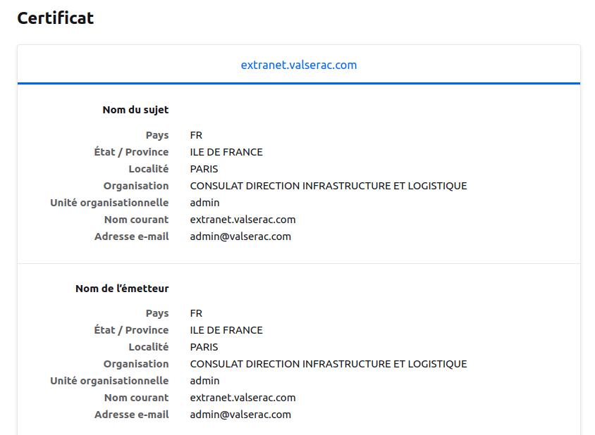
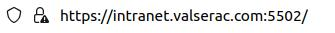
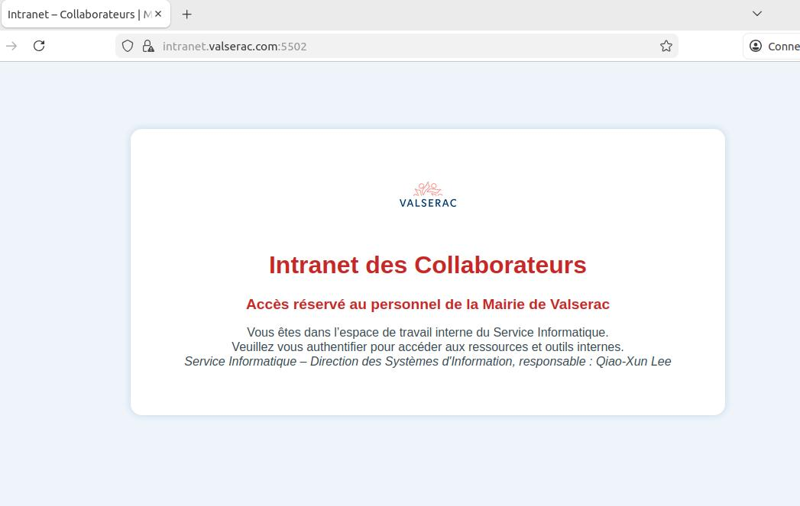
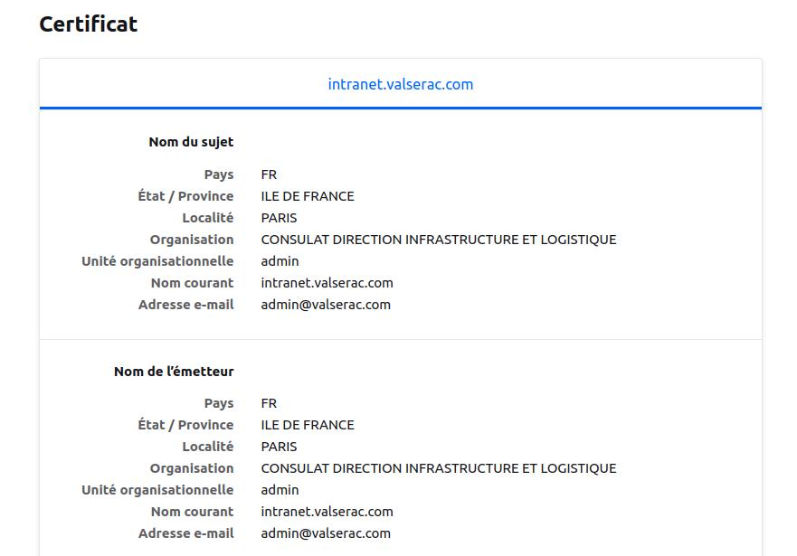
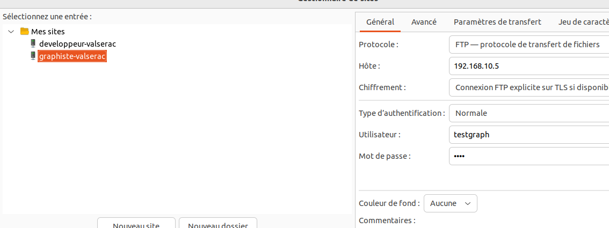
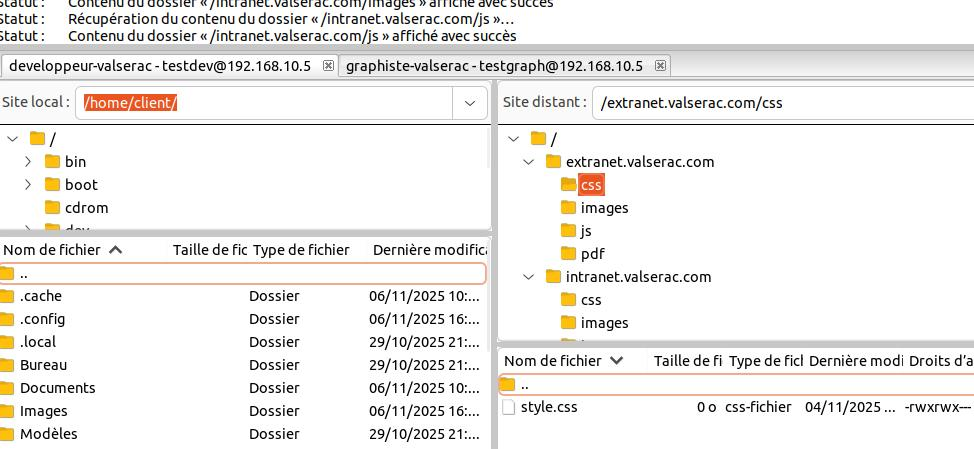
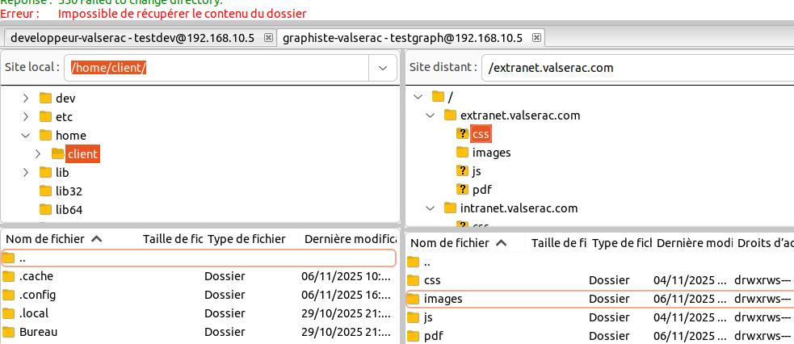
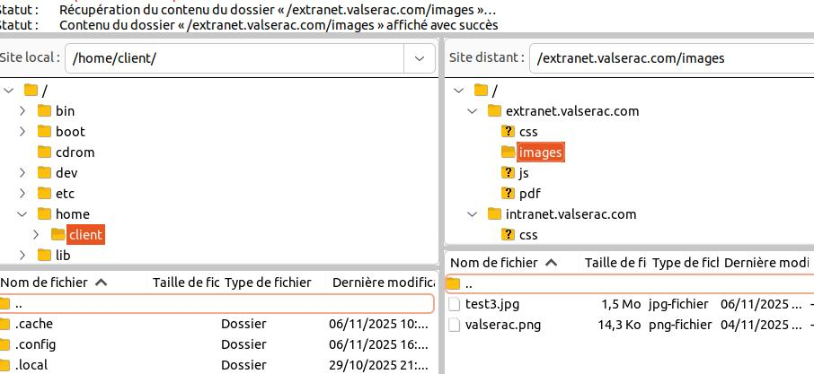
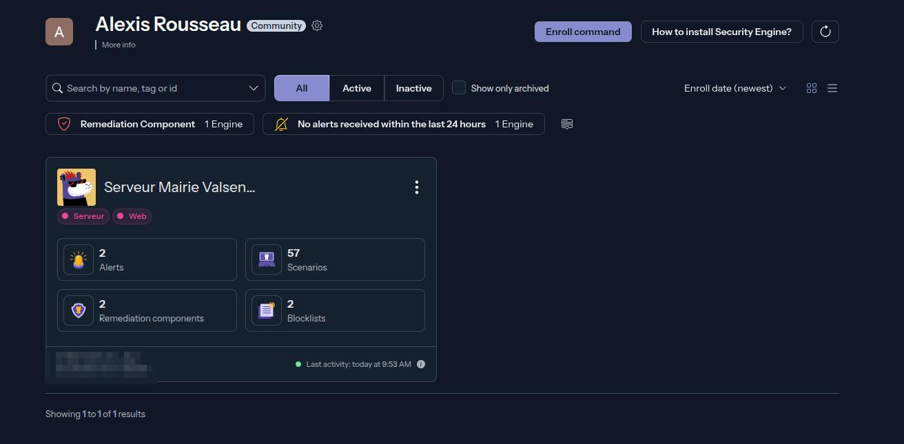
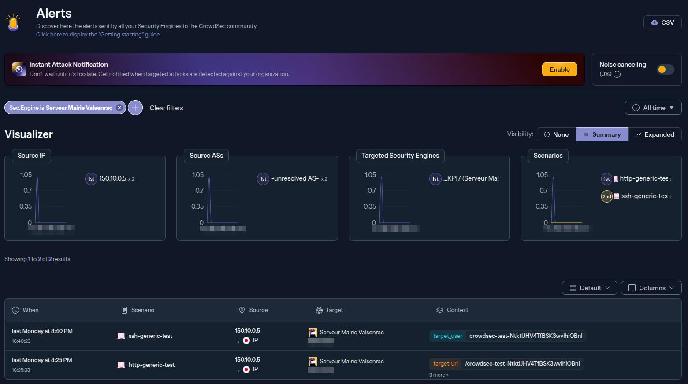

# Mettez en place des infrastructures et services Web sécurisés

**Projet n°04 - Réalisé dans le cadre de la Formation Openclassrooms - Administrateur systeme réseaux et Cybersécurité**

##  Detail Mission 
**Objectif :** Créer un prototype opérationnel pour **l’EXTRANET** et **l’INTRANET** de la **mairie de Valserac**, 
- incluant : 
    - Serveur Web sécurisé, 
    - Serveur FTP sécurisé en FTPS
    - Filtrage réseau,
    - Protection avancée.

**Context :**
Administrateur systèmes et réseaux. Le Dr. Bertri a validé le projet. 
Votre mission : fournir un prototype fonctionnel pour valider l’infrastructure avant le développement complet.

--- 

##  Détail Objectif
- **n°1.** Installer et configurer une VM Linux avec Ubuntu Server pour le serveur WEB.
    - Avec deux Pattes Réseaux : 
        - Public simulé avec `150.10.0.0/16`
        - Privé avec `192.168.10.0/24`

- **n°2.** Créer deux sites distincts :  
  - 🌐 **Extranet public**  - Acces Public simulé sur `150.10.0.0/16`
  - 🔒 **Intranet privé** - Acces Uniquement via la patte réseau `192.168.10.0/24`

- **n°3.** Redirection HTTP vers HTTPS avec generation Certificat SSL

- **n°4.** Mettre en place un serveur FTPS sécurisé
    - Les **developpeur** ont *acces* a l'ensemble des fichiers `/Extranet` et `/Intranet`
    - Les **graphistes** ont *accès* seulement aux Dossiers `/Images` de chaque sites, Extranet et Intranet
    - Toute personne ayant *acces* à l'Extranet doit pouvoir deposer un fichier au format `.PDF` dans le dossier `/pdf` dans Extranet depuis l'Extranet

- **n°5.** Configurer un filtrage réseau strict :
    - Avec UFW
    - Mod_Evasive

- **n°6.** Déployer CrowdSec pour prévenir les attaques :
    - Simuler des Attaques et Remonter sur la console CrowdSec

---

##  Configuration réseau - VM-Serveur

1. VM Créé via VirtualBox : 
    - OS : Ubuntu Server 22.04 - minimal graphic
    - 2 Pattes Réseaux NATNetwork : 
        - `192.168.10.0/24`
        - `150.10.0.0/16`

2. **Attribution IPs Statiques** 
    - Pour intranet (eth0) : `192.168.10.5/24`
    - Pour extranet (eth1) : `150.10.0.5/16`

    - S'assurer que tout est à jours : `sudo apt update && sudo apt upgrade -y`

    - Un Fichier de Configuration IP avec Netplan a été créé au format `.yaml` 
        - ici : `/etc/netplan/00-installer-config.yaml`
    ```yaml 
    network:
        version: 2
        ethernets:
            enp0s3:
                dhcp4: no
                addresses: [192.168.10.5/24]
                gateway4: 192.168.10.1
                nameservers:
                    addresses: [8.8.8.8,8.8.4.4]
            enp0s8:
                dhcp4: no
                addresses: [150.10.0.5/16]           
    ```
    
    - La configuration réseau a été appliqué via : `sudo netplan apply`
    

## ** Configuration** 
|         | SERVEUR | DEV | GRAPHISTE |
|----------|--------|-----------|-----------|
| OS      | Ubuntu-Serveur 22.04 | Ubuntu 22.04 | Ubuntu 22.04 |
| Nom DNS | vm-serveur| vm-dev | vm-graphiste |
| IP Privé | `192.168.10.5` | `192.168.10.10` | `192.168.10.12` |
| IP Public simulé | `150.10.0.5` | `150.10.0.10` | `150.10.0.12` |

- Ici le DNS à été simulié via `/etc/hosts` de chaque machine

On a donc maintenant :
- [x] Serveur pret
- [x] Machine Dev Test pret
- [x] Machine Graphiste Test pret
- [x] Réseaux Fonctionnel inter-machine

---
##  Installation du Serveur Web

###  Installation

- Commande Installation d'Apache

```bash 
sudo apt install apache2 -y     ## Installation Apache2
sudo systemctl enable apache2   ## Lancer Automatiquement au démarage
sudo systemctl start apache2    ## Lancer Apache2
```
- Commande pour Activer/Desactiver les Modules Apache
```bash 
sudo a2enmod ssl                  ## Activé module ssl → HTTPS  
sudo a2enmod headers              ## Activé module header → securite
sudo a2enmod rewrite              ## activé module rewrite → Redirection
sudo a2dismod autoindex status    ## Desactive module inutiles
sudo systemctl restart apache2    ## Relancer Apache2
```


- Récupération des sites `/extranet` et `/intranet`
- Placé dans le répertoire `/var/www/`

- Ce qui nous donne une arborescence : 
```
./var/www/
├── extranet.valserac.com/        
│   ├── images/
│   ├── pdf/
│   ├── js/
│   ├── css/
│   └── index.html
├── intranet.valserac.com/
    ├── images/
    ├── js/
    ├── css/
    └── index.html
```
- Pour l'instant, nous laissons `www-data:www-data` en *proprietaire* et *groupe* (Apache)
```bash
sudo chown -R www-data:www-data /var/www/extranet.valserac.com  
sudo chown -R www-data:www-data /var/www/intranet.valserac.com
sudo chmod -R 755 /var/www
```
---
###  Configuration

- Rappels des Objectifs : 
    - 1.Extranet.vaslerac.com ( public )
        - IP : 150.10.0.5 
        - Ports : HTTP 80 → redirigé vers HTTPS 443
        - SSL : Certificat auto-signé ( pour le lab )

    - 2.Intranet.valserac.com : 
        - IP : 192.168.10.5
        - Ports : HTTP 5501 → redirigé vers HTTPS 5502
        - SSL : Certificat auto-signé ( pour le lab )

- Chaque VHost aura : 
    - Redirection HTTP → HTTPS
    - Logs séparés ( acces.log )
    - Droits sécurités sur les repertoires

Rappels Dossier de Configuration : `/etc/apache2/`

```bash
./etc/apache2/                ## Répertoire de Configuration Apache
├── sites-available/            ## Configuration des Vhosts de nos sites
│   ├── extranet.conf               # Vhost extranet
│   └── intranet.conf               # Vhost intranet
├── sites-enabled/              ## -- Sites Actifs
│
├── mods-available/             ## Configuration des Modules
├── mods-enabled/               ## -- Modules Actifs
│
├── ssl/                        ## Configuration de nos SSL
│
├── conf-available/             ## Configuration 
│   └── security.conf            
├── conf-enable/                ## -- Configuration actifs
│ 
├── apache2.conf               ## Configuration global d'apache2   
└── ports.conf                  ## Fichier Configuration des ports 
```


### Mesure de sécurité Générique 
- Cacher les **informations du serveur** dans le fichier `security.conf`
```bash
sudo nano /etc/apache2/conf-available/security.conf
```

- Puis on **modifie** pour **cacher la version** et les **informations** du Serveur
- Et désactivé les **requêtes TRACE**

```bash
# Cacher la version et les informations du serveur
ServerTokens Prod
ServerSignature Off
# Désactiver les requêtes TRACE
TraceEnable Off
# Protéger contre les attaques clickjacking et XSS
Header always append X-Frame-Options SAMEORIGIN
```

---

### **Génération de Certificats SSL Auto-signé avec `openssl`**


- Pour **extranet.valserac.com** :
```bash
sudo mkdir -p /etc/apache2/ssl              ## Création répertoire ssl/

sudo openssl req -x509 -nodes -days 365 \   ## Generation ssl
  -newkey rsa:2048 \
  -keyout /etc/apache2/ssl/extranet.key \   ## Notre key ssl
  -out /etc/apache2/ssl/extranet.crt        ## Notre Certificat ssl

```

- Information Certificat entré : 
    - Country Name (2 letter code) : FR
    - State or Province Name : ILE DE FRANCE
    - Locality Name : PARIS
    - Organization Name : CONSULAT DIRECTION INFRASTRUCTURE ET LOGISTIQUE
    - Organizational Unit Name : admin
    - Common Name : *extranet.valserac.com*
    - Email Address : admin@valserac.com (fictif)

- Pour **intranet.valserac.com** :
```bash
sudo openssl req -x509 -nodes -days 365 \   ## Generation ssl
  -newkey rsa:2048 \
  -keyout /etc/apache2/ssl/intranet.key \   ## Notre key ssl
  -out /etc/apache2/ssl/intranet.crt        ## Notre Certificat ssl
```

- Information Certificat entré : 
    - Country Name (2 letter code) : FR
    - State or Province Name : ILE DE FRANCE
    - Locality Name : PARIS
    - Organization Name : CONSULAT DIRECTION INFRASTRUCTURE ET LOGISTIQUE
    - Organizational Unit Name : admin
    - Common Name : *intranet.valserac.com*
    - Email Address : admin@valserac.com (fictif)

---
 
### Creation des fichiers Virtual Host - VHost
- Pour **extranet.valserac.com**
```bash
# FORCER UTILISATION HTTPS
<VirtualHost 150.10.0.5:80>    ##Forcer l'ecoute de 150.10.0.5 pour Virualbox
    ## NAME & DOC ROOT
    ServerName extranet.valserac.com
    DocumentRoot /var/www/extranet.valserac.com

    ## FORCE HTTPS
    Redirect / https://extranet.valserac.com
    RewriteEngine On
    RewriteRule ^(.*)$ https://%{HTTP_HOST}$1 [R=301,L]

    ## SETUP LES LOGS
    ErrorLog ${APACHE_LOG_DIR}/error.log
    CustomLog ${APACHE_LOG_DIR}/extranet_access.log combined
</VirtualHost>

# CONFIG SSL
<VirtualHost 150.10.0.5:443>    ##Forcer l'ecoute de 150.10.0.5 pour Virualbox
    ## NAME & DOC ROOT
    ServerName extranet.valserac.com
    DocumentRoot /var/www/extranet.valserac.com

    ## CONDIF SSL SECURISE
    SSLEngine on
    SSLCertificateFile /etc/apache2/ssl/extranet.crt
    SSLCertificateKeyFile /etc/apache2/ssl/extranet.key

    ## PROTOCOLE SSL SECURISE
    SSLProtocol all -SSLv2 -SSLv3 -TLSv1 -TLSv1.1
    SSLCipherSuite EECDH+AESGCM:EDH+AESGCM:AES256+EECDH:AES256+EDH
    SSLHonorCipherOrder on

    ## EN TETE de SECURITE
    Header always set Strict-Transport-Security "max-age=63072000; includeSubDomains; preload"
    Header always append X-Frame-Options SAMEORIGIN
    Header always set X-XSS-Protection "1; mode=block"
    Header always set X-Content-Type-Options nosniff

    ## DESACTIVE LISTAGE REPERTOIRE
    <Directory /var/www/extranet.valserac.com>
        Options -Indexes -FollowSymLinks
        AllowOverride None
        Require all granted
    </Directory>

    ## SETUP LES LOGS 
    ErrorLog ${APACHE_LOG_DIR}/error.log
    CustomLog ${APACHE_LOG_DIR}/extranet_access.log combined
</VirtualHost>
```

- Activé le site → lien symbobique de `sites-available` à `site-enable`
```bash
sudo a2ensite extranet.conf         ## Racourcie UP le site via a2
sudo systemctl reload apache2       ## Reloader Apache2
```

- Vérifier la configuration
```bash
sudo apache2ctl configtest          ## Si synthaxe Ok
sudo systemctl restart apache2      ## Relancer
```

---
   
### Teste realisé sur la `vm-graphiste` et `vm-dev`
- Configuration du `/ect/hosts/` pour `150.10.0.5 extranet.valserac.com`

       



On a donc un Extranet sur **extranet.valserac.com**:
- [x] **Ouvert** sur l'interface 150.10.0.5 du serveur
- [x] **Redirection Actif** de `:80` → `:443` en HTTPS
- [x] **Certificat SSL Actif** sur *extranet.valserac.com*

---
 
- Pour **intranet.valserac.com** :
    - Ici, pour l'intranet, le choix c'est porté d'écouter sur `5501` pour le HTTP et `5502` pour le HTTPS afin d'eviter les ports trop evident.
    - On va également **restreindre l'accès**, seulement sur la patte Réseau `192.168.10.0/24` 

- Dans un premier temps, nous devons donc **ajouter** à Apache l'écoute sur le port `5501` et `5502`
    - dans le fichier de configuration `/etc/apache2/ports.conf`

```bash
## Extranet PORT
Listen 150.10.0.5:80
Listen 150.10.0.5:443

## Intranet PORT
Listen 192.168.10.5:5501
Listen 192.168.10.5:5502
```
*Note : Pour que VirtualBox gèrent correctement les deux pattes réseaux, on force l'écoute respective*
- *de la patte réseau `150.10.0.5` sur le port `80` et `443`*
- *de la seconde patte réseau `192.168.10.5` sur `5501` et `5502`*

Nous pouvons maintenant passez à la **configuration** de la VHost nommé **intranet.conf**

```bash
## CONFIG HTTP sur 5501 et REDIRECTION VERS HTTPS sur 5502
<VirtualHost 192.168.10.5:5501>
    ## NAME & DOC ROOT
    ServerName intranet.valserac.com
    DocumentRoot /var/www/intranet.valserac.com

    ## FORCER REDIRECTION VERS HTTPS:5502
    Redirect / https://intranet.valserac.com:5502/

    ## SETUP LOGS
    ErrorLog ${APACHE_LOG_DIR}/intranet_error.log
    CustomLog ${APACHE_LOG_DIR}/intranet_access.log combined
</VirtualHost>

## INTRANET HTTPS sur 5502 et LIMITATION a 192.168.10.0/24
<VirtualHost 192.168.10.5:5502>
    ## NAME & DOC ROOT
    ServerName intranet.valserac.com
    DocumentRoot /var/www/intranet.valserac.com

    ## ACTIVITE CERTIFACT SSL 
    SSLEngine on
    SSLCertificateFile /etc/apache2/ssl/intranet.crt
    SSLCertificateKeyFile /etc/apache2/ssl/intranet.key

    ## PROTOCOLE SSL SECURISES 
    SSLProtocol all -SSLv2 -SSLv3 -TLSv1 -TLSv1.1
    SSLCipherSuite EECDH+AESGCM:EDH+AESGCM:AES256+EECDH:AES256+EDH
    SSLHonorCipherOrder on

    ## EN TETE SECURITE 
    Header always set Strict-Transport-Security "max-age=63072000; includeSubDomains; preload"

    ## DESACTIVATION LISTAGE & LIMITATION IP
    <Directory /var/www/intranet.valserac.com>
        DirectoryIndex index.html index.php
        Options -Indexes -FollowSymLinks
        AllowOverride None
        Require all granted
        ## LIMITATION a 192.168.10.0/24
        Require ip 192.168.10.0/24
    </Directory>

    ## SETUP LOGS 
    ErrorLog ${APACHE_LOG_DIR}/intranet_error.log
    CustomLog ${APACHE_LOG_DIR}/intranet_access.log combined
</VirtualHost>
```
Une fois **activé** avec le m**odule a2** et **relancé le systeme** apache avec les commandes plus haut. Nous pouvons donc maintenant tester sur nos `vm-dev` et `vm-graphiste`

---
   

### Teste realisé sur la `vm-graphiste` et `vm-dev`
- Configuration du `/ect/hosts/` pour `192.168.10.5 intranet.valserac.com`

       



On a donc un Intranet sur **intranet.valserac.com**:
- [x] **Ouvert** sur l'interface 192.168.10.5 et uniquement accessible par la patte réseau `192.168.10.0/24`
- [x] **Redirection Actif** de `:5501` → `:5502` en HTTPS
- [x] **Certificat SSL Actif** sur *intranet.valserac.com*

---

 
## Configuration du Service FTPS

- Nous allons maintenant passez à la configuration du service FTP Sécurisé pour nos déveoppeur et Graphiste
- Rappels de la configuration necessaire : 
    - Les graphistes doivent pouvoir acceder au fichier /`images` de chaque site 
    - Les developpeurs doivent pouvoir avoir **acces à l'ensemble** des fichiers des sites. 

- Pour le service FTP nous allons utilisé le service `vsftp`

```bash
sudo apt install vsftpd -y                       ##Installation 
sudo cp /etc/vsftpd.conf /etc/vsftpd.conf.backup ##Backup de la config initial
```
- Nous allons editer le fichier de configuration du service `vsftp`
    - ici `/etc/vsftpd.conf`
- Nous allons également **générer un certificat TLS** pour le service FTP afin de sécuriser les tranferts ici 


```bash
sudo openssl req -x509 -nodes -days 365 -newkey rsa:2048 \
-keyout /etc/apache2/ssl/vsftpd.key \
-out /etc/apache2/ssl/vsftpd.pem
```

- Configuration supplémentaire apporté : 
    - Ecoute sur les ports `40000` et `40100`
    - En acces uniquement via l'interface réseau `192.168.10.5`

```bash
## PARAMETRE généraux
listen=YES
listen_ipv6=NO

write_enable=YES
dirmessage_enable=YES
use_localtime=YES
xferlog_enable=YES
xferlog_std_format=YES
secure_chroot_dir=/var/run/vsftpd/empty
pam_service_name=vsftpd

## Désactiver Acces anonyme
anonymous_enable=NO

listen_address=192.168.10.5

## Configuration du chroot utilisateurs
local_enable=YES
chroot_local_user=YES
allow_writeable_chroot=YES
local_root=/var/www


## Configuration du mode passif
pasv_enable=YES
pasv_min_port=40000
pasv_max_port=40100
pasv_address=192.168.10.5


## Configuration de journalisation avancée
log_ftp_protocol=YES
xferlog_enable=YES
xferlog_std_format=YES
xferlog_file=/var/log/vsftpd.log


## SECU Transfert
rsa_cert_file=/etc/apache2/ssl/vsftpd.pem
rsa_private_key_file=/etc/apache2/ssl/vsftpd.key

## SSL SECU
ssl_enable=YES
allow_anon_ssl=NO
force_local_data_ssl=YES
force_local_logins_ssl=YES
ssl_tlsv1=YES
ssl_sslv2=NO
ssl_sslv3=NO
require_ssl_reuse=NO
ssl_ciphers=HIGH
```
- On va pouvoir **redemarrer** et **activer** les services par default

```bash
sudo systemctl restart vsftpd
sudo systemctl enable vsftpd
sudo systemctl status vsftpd   ##Checker le status actifs
```
 

### Gestion des Utilisateurs et Permissions
 - Nous allons maintenant pouvoir **créer les groupes** utilisateurs pour l'accès au différents fichiers 
    - Pour les graphistes 
        - Groupe : **graph**
        - user : `testgraph`
    - Pour les developpeurs 
        - Groupe : **dev**
        - user : `testdev`
    - Pour les graphistes et developpeurs 
        - Groupe : **web**
        - user : `testgraph` & `testdev`

```bash
sudo adduser testgraph              ##Creation user
sudo adduser testdev               
sudo groupadd graph                 ##Creation groupe 
sudo groupadd dev                   
sudo groupadd web                   
sudo usermod a-G graph testgraph    ##Ajout des users au groupe
sudo usermod a-G dev testdev
sudo usermod a-G web testgraph 
sudo userùpd a-F web testsdev

sudo passwd testgraph               ##Ajout mot de passe
sudo passwd testdev
```

- On peut donc maintenant attribué les bonnes attribution et permission aux dossiers
- Le choix a été fait de garder apache en proprietaire (www-data) sur l'ensemble des fichiers 

- Pour l'architecture général et l'acces aux dossiers : 
    - extranet.valserac.com
    - intranet.valserac.com 

afin de ne pas bloquer les graphistes qui ont seulenement accès au dossier image,
on a donc  créé le groupe `web` avec `testgraph` et `testdev`, qui auront accès a ces deux dossiers.
Avec permission de `750`, qui permettraau groupe d'y avoir seulement acces.

```bash
sudo chown www-data:web /var/www/extranet.valserac.com
sudo chown www-data:web /var/www/intranet.valserac.com
sudo chmod 750 /var/www/extranet.valserac.com
sudo chmod 750 /var/www/intranet.valserac.com
```

- Puis à l'intérieur de ses deux répertoires, ce sera toujours **apache** en propriétaire et le **groupe dev** qui ont l'accès
- Avec une permission ici pour une gestion des **développeurs** attribué à `770`

```bash
sudo chown -R www-data:dev /var/www/extranet.valserac.com/*
sudo chown -R www-data:dev /var/www/intranet.valserac.com/*
sudo chmod -R 770 /var/www/extranet.valserac.com/*
sudo chmod -R 770 /var/www/intranet.valserac.com/*
```
- On peut donc mainteant passé à l'attribution du fichier `/images` par le groupe `web` pour : 
    - Un acces des graphistes
    - Un acces pour les developpeurs

```bash
sudo chown -R www-data:web /var/www/extranet.valserac.com/images
sudo chown -R www-data:web /var/www/intranet.valserac.com/images
sudo chmod -R 770 /var/www/extranet.valserac.com/images
sudo chmod -R 770 /var/www/intranet.valserac.com/images 
```

- **Configuration Spéciale pour le répertoire `/pdf` uniquement accessible par Apache** 

```bash 
sudo chown -R www-data:www-data /var/www/extranet.valserac.com/pdf
sudo chmod -R 770 /var/www/extranet.valserac.com/pdf
```


- On a donc maintenant un accès spécifique par groupe d'utilisations et une segmentation des permissions
- Ainsi qu'une configuration de vsftpd utilisable

---
 
### Teste du FTPS sur les vm-dev et vm-graphiste 

- Afin de **simuler** un environnement de travail inter-département, le choix s'est porter d'utiliser **FileZilla** 
- Après avoir installer et configuré la connexion via l'interface de FilZilla avec **l'adresse IP du Serveur**, **Le Users** et **mot de passe** adéquat, configuré en **paramètre passive** comme configuré dans le `vsftpd.conf`

1. **Acces des comptes par fileZilla :**



2. Connexion avec le compte **Developpeur**


- [x] **Etablie** ayant acces à l'ensemble des fichiers

3. **Connexion avec le compte Graphiste** ( exemple sur le répertoire `/css`)


- [x] **Etablie** ayant acces refusé au autres répertoires du site ( exemple sur le répertoire `/css`)

3. **Connexion avec le compte Graphiste** ( exemple sur le répertoire `/images`)



- [x] **Etablie** ayant acces reussi sur le dossier `/images`
- [x] **Test Upload** reussi dans le dossier `/images`

 

### On a donc maintenant un service FTP Sécurisé établie sur notre serveur et un accès spécifique par compte *Devloppeur* et *Graphiste*.

---
 
## Configuration du parfeu avec UFW

La mise en place du parfeu par **UFW** a été mis a jour durant la mise en place du projet web

- Mais la règle général a été de tout `Deny` dans un premier temps
- Puis **d'Authorisé** le port `22` pour **SSH** pour administrer le serveur depuis l'Hote
- D'**Authorisé** le port `80` (HTTP) et `443`(HTTPS) sur l'interface **enp0s8** `150.10.0.5` sur Tout - Simulation Extranet publique
- D'**Authorisé** le port `5501` et `5502` sur l'interface **enp0s3** uniquement accessible via la patte réseau `192.168.10.0/24`
- et d'**Authorisé** plusieurs port pour le **FTPS** : 
    - port `20` et `21` uniquement via `192.168.10.0/24`
    - puis port `40000:40100` uniquement via `192.168.10.0/24`
    - et également le port `990` uniquement via `192.168.10.0/24`

```bash
To                         Action      From
--                         ------      ----         
80,443/tcp on enp0s8       ALLOW IN    Anywhere                  
5501,5502/tcp on enp0s3    ALLOW IN    192.168.10.0/24  
         
20/tcp                     ALLOW IN    192.168.10.0/24 
21/tcp                     ALLOW IN    192.168.10.0/24   
22/tcp                     ALLOW IN    Anywhere   
        
40000:40100/tcp            ALLOW IN    192.168.10.0/24                   
990/tcp                    ALLOW IN    192.168.10.0/24 
```

---
 
### Partie Securisation Active 
1. Défense **Local** (Apache) avec le **mod_evasive** vs attaque type DoS simple / abusive sur Apache
2. Dégense **Collaboratve** au niveau du Systeme avec **Crowdsec** au niveau des IP

### Partie 1 - Installation et configuration de `mod_evasive`
**Installation**

```bash
sudp apt install libapache2-mod-evasive -y      ##Installation du mod evasive
sudo a2enmod evasive                            ##Activation Evasive avec a2
```
**Configuration de base**
- Fichier de Configuration : `/etc/apache2/mods-available/evasive.conf`

```bash
<IfModule mod_evasive20.c>
    DOSHashTableSize    3097
    DOSPageCount        2              ##Plus de 2 requetes meme pages
    DOSSiteCount        50
    DOSPageInterval     1
    DOSSiteInterval     1
    DOSBlockingPeriod   10             ##Bloque pour 10sec

    DOSEmailNotify      admin@valserac.com
    DOSSystemCommand    "su - someuser -c '/sbin/... %s ...'"
    DOSLogDir           "/var/log/mod_evasive"
</IfModule>
```

- [x] Installation et Configuration Simple du `mod_evasive` d'Apache vs les attaques DDos simple

 
## Installation et Configuration de Crowdsec

CrowdSec detecte les Intrusions et fait de la prévention
- Il surveille les logs systeme ( Apache, SSH, FTP, etc )
- Détecte les Comportements suspects et Bannit automatiquement les IPS

- Bénéficie d'une Base Communautaire regroupant des bibles d'adresse mailveillantes partagé entre les utilisateurs du monde en entier

**1. Instalation de CrowdSec via** 
```bash
sudo apt install crowdsec -y
```
Crowdsec détecte automatique les services et configure les logs

**2. Check les collections des services pris en charge**
```bash 
sudo cscli collections list
```
**3. Ajouter le Bouncer ( le Bloqueur )**
- ici, on veut celui d'apache

```bash
sudo apt install crowdsec-bouncer-apache -y
```
**4. Vérifier que le bouncer est installé via**
```bash
sudo cscli bouncers list
```

**5.Mettre explicitement le liens vers les logs d'Apache pour Crowdsec**
- Via la configuration du fichier `acquis.yaml`
- ici : `/etc/crowdsec/acquis.yaml`

Configuration necessaire :
```bash
filenames:
  - /var/log/apache2/access.log
  - /var/log/apache2/error.log
labels:
  type: apache2
```

**6. Puis relance et checker Crowdsec**
```bash
sudo systemctl reload crowdsec
sudo systemctl status crowdsec
```

---
  

### Après configuration avec la console de Crowdsec & Serveur

- Configureration de notre serveur avec la console Crowdsec 




- S'assurer que les logs des attaques remontes & bloque le IP :
    - Test des Scénario d'attaque sur SSH et HTTP généric 
- Remonté sur la console Crowdsec 



- On a donc mainteant notre serveur web qui possède une sécurisation via 
    - `mod_evasive` d'Apache vs les **DDos simple**
    - `Crowdsec` pour une protection Communautaire vs les IPs 


### Conclusion du Projet 

Au cours de ce projet sur l'installation et la configuration d'une Infrastructure web via la mairie de Valserac.
On a pu monter en compétence sur : 
- l'**Administration système** avec l'installation, la configuration et la gestion de services Linux
- Le **réseaux**, avec les différents NAT, pare-feu, ports et protcoles
- Une mise en place de **Cybersécurité**, avec une **protection applicative** de `Crowdsec` et d'une protection de **DDos** avec `Evasive`
- Une Supervision sur la lecture et exploitation des logs
- Sur la manipulation applicative des commandes **shell**
- Ainsi qu'une **redaction de rapport de la documentation technique**

**Merci** d'avoir pris le temps de lire mon projet **d'infrastruce web**, un projet qui s'inscrit dans l'apprentissage et la monté en compétences au travers de la formation **Administrateur système, réseaux et cybersécurité.**

---
**Alexis alias Faramir!**
