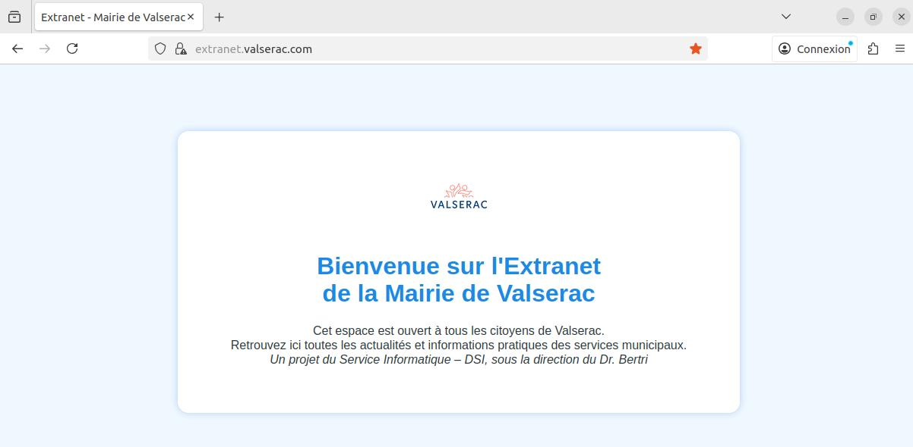

# Mettez en place des infrastructures et services Web sécurisés

**Projet n°04 - Réalisé dans le cadre de la Formation Openclassrooms - Administrateur systeme réseaux et Cybersécurité**

##  Detail Mission 
**Objectif :** Créer un prototype opérationnel pour **l’EXTRANET** et **l’INTRANET** de la **mairie de Valserac**, 
- incluant : 
    - Serveur LAMP sécurisé, 
    - Serveur FTP sécurisé en FTPS
    - Filtrage réseau,
    - Protection avancée.

**Context :**
Administrateur systèmes et réseaux. Le Dr. Bertri a validé le projet. 
Votre mission : fournir un prototype fonctionnel pour valider l’infrastructure avant le développement complet.

--- 

##  Détail Objectif
- **n°1.** Installer et configurer une VM Linux avec Ubuntu Server pour le serveur LAMP.
    - Avec deux Pattes Réseaux : 
        - Public simulé avec `150.10.0.0/16`
        - Privé avec `192.168.10.0/24`

- **n°2.** Créer deux sites distincts :  
  - 🌐 **Extranet public**  - Acces Public simulé sur `150.10.0.0/16`
  - 🔒 **Intranet privé** - Acces Uniquement via la patte réseau `192.168.10.0/24`

- **n°3.** Redirection HTTP vers HTTPS avec generation Certificat SSL

- **n°4.** Mettre en place un serveur FTPS sécurisé
    - Les **developpeur** ont *acces* a l'ensemble des fichiers `/Extranet` et `/Intranet`
    - Les **graphistes** ont *accès* seulement aux Dossiers `/Images` de chaque sites, Extranet et Intranet
    - Toute personne ayant *acces* à l'Extranet doit pouvoir deposer un fichier au format `.PDF` dans le dossier `/pdf` dans Extranet depuis l'Extranet

- **n°5.** Configurer un filtrage réseau strict :
    - Avec UFW
    - Mod_Evasive

- **n°6.** Déployer CrowdSec pour prévenir les attaques :
    - Simuler des Attaques et Remonter sur la console CrowdSec

---

##  Configuration réseau - VM-Serveur

1. VM Créé via VirtualBox : 
    - OS : Ubuntu Server 22.04 - minimal graphic
    - 2 Pattes Réseaux NATNetwork : 
        - `192.168.10.0/24`
        - `150.10.0.0/16`

2. **Attribution IPs Statiques** 
    - Pour intranet (eth0) : `192.168.10.5/24`
    - Pour extranet (eth1) : `150.10.0.5/16`

    - S'assurer que tout est à jours : `sudo apt update && sudo apt upgrade -y`

    - Un Fichier de Configuration IP avec Netplan a été créé au format `.yaml` 
        - ici : `/etc/netplan/00-installer-config.yaml`
    ```yaml 
    network:
        version: 2
        ethernets:
            enp0s3:
                dhcp4: no
                addresses: [192.168.10.5/24]
                gateway4: 192.168.10.1
                nameservers:
                    addresses: [8.8.8.8,8.8.4.4]
            enp0s8:
                dhcp4: no
                addresses: [150.10.0.5/16]           
    ```
    
    - La configuration réseau a été appliqué via : `sudo netplan apply`
    

## ** Configuration** 
|         | SERVEUR | DEV | GRAPHISTE |
|----------|--------|-----------|-----------|
| OS      | Ubuntu-Serveur 22.04 | Ubuntu 22.04 | Ubuntu 22.04 |
| Nom DNS | vm-serveur| vm-dev | vm-graphiste |
| IP Privé | `192.168.10.5` | `192.168.10.10` | `192.168.10.12` |
| IP Public simulé | `150.10.0.5` | `150.10.0.10` | `150.10.0.12` |

- Ici le DNS à été simulié via `/etc/hosts` de chaque machine

On a donc maintenant :
- [x] Serveur Configuré
- [x] Machine Dev Test Configuré
- [x] Machine Graphiste Test Configuré
- [x] Réseaux Fonctionnel inter-machine

##  Installation du Serveur Web

###  Installation

- Commande Installation d'Apache

```bash 
sudo apt install apache2 -y     ## Installation Apache2
sudo systemctl enable apache2   ## Lancer Automatiquement au démarage
sudo systemctl start apache2    ## Lancer Apache2
```
- Commande pour Activer/Desactiver les Modules Apache
```bash 
sudo a2enmod ssl                  ## Activé module ssl → HTTPS  
sudo a2enmod headers              ## Activé module header → securite
sudo a2enmod rewrite              ## activé module rewrite → Redirection
sudo a2dismod autoindex status    ## Desactive module inutiles
sudo systemctl restart apache2    ## Relancer Apache2
```

- Récupération des sites `/extranet` et `/intranet`
- Placé dans le répertoire `/var/www/`

- Ce qui nous donne une arborescence : 
```
./var/www/
├── extranet.valserac.com/        
│   ├── images/
│   ├── pdf/
│   ├── js/
│   ├── css/
│   └── index.html
├── intranet.valserac.com/
    ├── images/
    ├── js/
    ├── css/
    └── index.html
```
- Pour l'instant, nous laissons `www-data:www-data` en *proprietaire* et *groupe* (Apache)
```bash
sudo chown -R www-data:www-data /var/www/extranet.valserac.com  
sudo chown -R www-data:www-data /var/www/intranet.valserac.com
sudo chmod -R 755 /var/www
```
 
###  Configuration

- Rappels des Objectifs : 
    - 1.Extranet.vaslerac.com ( public )
        - IP : 150.10.0.5 
        - Ports : HTTP 80 → redirigé vers HTTPS 443
        - SSL : Certificat auto-signé ( pour le lab )

    - 2.Intranet.valserac.com : 
        - IP : 192.168.10.5
        - Ports : HTTP 5501 → redirigé vers HTTPS 5502
        - SSL : Certificat auto-signé ( pour le lab )

- Chaque VHost aura : 
    - Redirection HTTP → HTTPS
    - Logs séparés ( acces.log )
    - Droits sécurités sur les repertoires

Rappels Dossier de Configuration : `/etc/apache2/`

```bash
./etc/apache2/                ## Répertoire de Configuration Apache
├── sites-available/            ## Configuration des Vhosts de nos sites
│   ├── extranet.conf               # Vhost extranet
│   └── intranet.conf               # Vhost intranet
├── sites-enabled/              ## -- Sites Actifs
│
├── mods-available/             ## Configuration des Modules
├── mods-enabled/               ## -- Modules Actifs
│
├── ssl/                        ## Configuration de nos SSL
│
├── conf-available/             ## Configuration 
│   └── security.conf            
├── conf-enable/                ## -- Configuration actifs
│ 
├── apache2.conf               ## Configuration global d'apache2   
└── ports.conf                  ## Fichier Configuration des ports 
```

### **Génération de Certificats SSL Auto-signé avec `openssl`**

- Pour **extranet.valserac.com** :
```bash
sudo mkdir -p /etc/apache2/ssl              ## Création répertoire ssl/

sudo openssl req -x509 -nodes -days 365 \   ## Generation ssl
  -newkey rsa:2048 \
  -keyout /etc/apache2/ssl/extranet.key \   ## Notre key ssl
  -out /etc/apache2/ssl/extranet.crt        ## Notre Certificat ssl

```

- Information Certificat entré : 
    - Country Name (2 letter code) : FR
    - State or Province Name : ILE DE FRANCE
    - Locality Name : PARIS
    - Organization Name : CONSULAT DIRECTION INFRASTRUCTURE ET LOGISTIQUE
    - Organizational Unit Name : admin
    - Common Name : *extranet.valserac.com*
    - Email Address : admin@valserac.com (fictif)

- Pour **intranet.valserac.com** :
```bash
sudo openssl req -x509 -nodes -days 365 \   ## Generation ssl
  -newkey rsa:2048 \
  -keyout /etc/apache2/ssl/intranet.key \   ## Notre key ssl
  -out /etc/apache2/ssl/intranet.crt        ## Notre Certificat ssl
```

- Information Certificat entré : 
    - Country Name (2 letter code) : FR
    - State or Province Name : ILE DE FRANCE
    - Locality Name : PARIS
    - Organization Name : CONSULAT DIRECTION INFRASTRUCTURE ET LOGISTIQUE
    - Organizational Unit Name : admin
    - Common Name : *intranet.valserac.com*
    - Email Address : admin@valserac.com (fictif)

### Creation des fichiers Virtual Host - VHost
- Pour **extranet.valserac.com**
```bash
# FORCER UTILISATION HTTPS
<VirtualHost 150.10.0.5:80>    ##Forcer l'ecoute de 150.10.0.5 pour Virualbox
    ## NAME & DOC ROOT
    ServerName extranet.valserac.com
    DocumentRoot /var/www/extranet.valserac.com

    ## FORCE HTTPS
    Redirect / https://extranet.valserac.com
    RewriteEngine On
    RewriteRule ^(.*)$ https://%{HTTP_HOST}$1 [R=301,L]

    ## SETUP LES LOGS
    ErrorLog ${APACHE_LOG_DIR}/error.log
    CustomLog ${APACHE_LOG_DIR}/extranet_access.log combined
</VirtualHost>

# CONFIG SSL
<VirtualHost 150.10.0.5:443>    ##Forcer l'ecoute de 150.10.0.5 pour Virualbox
    ## NAME & DOC ROOT
    ServerName extranet.valserac.com
    DocumentRoot /var/www/extranet.valserac.com

    ## CONDIF SSL SECURISE
    SSLEngine on
    SSLCertificateFile /etc/apache2/ssl/extranet.crt
    SSLCertificateKeyFile /etc/apache2/ssl/extranet.key

    ## PROTOCOLE SSL SECURISE
    SSLProtocol all -SSLv2 -SSLv3 -TLSv1 -TLSv1.1
    SSLCipherSuite EECDH+AESGCM:EDH+AESGCM:AES256+EECDH:AES256+EDH
    SSLHonorCipherOrder on

    ## EN TETE de SECURITE
    Header always set Strict-Transport-Security "max-age=63072000; includeSubDomains; preload"
    Header always append X-Frame-Options SAMEORIGIN
    Header always set X-XSS-Protection "1; mode=block"
    Header always set X-Content-Type-Options nosniff

    ## DESACTIVE LISTAGE REPERTOIRE
    <Directory /var/www/extranet.valserac.com>
        Options -Indexes -FollowSymLinks
        AllowOverride None
        Require all granted
    </Directory>

    ## SETUP LES LOGS 
    ErrorLog ${APACHE_LOG_DIR}/error.log
    CustomLog ${APACHE_LOG_DIR}/extranet_access.log combined
</VirtualHost>
```

- Activé le site → lien symbobique de `sites-available` à `site-enable`
```bash
sudo a2ensite extranet.conf         ## Racourcie UP le site via a2
sudo systemctl reload apache2       ## Reloader Apache2
```

- Vérifier la configuration
```bash
sudo apache2ctl configtest          ## Si synthaxe Ok
sudo systemctl restart apache2      ## Relancer
```

- **Teste realisé sur la `vm-graphiste` et `vm-dev`**

        Configuration du `/ect/hosts/` pour `150.10.0.5 extranet.valserac.com`

